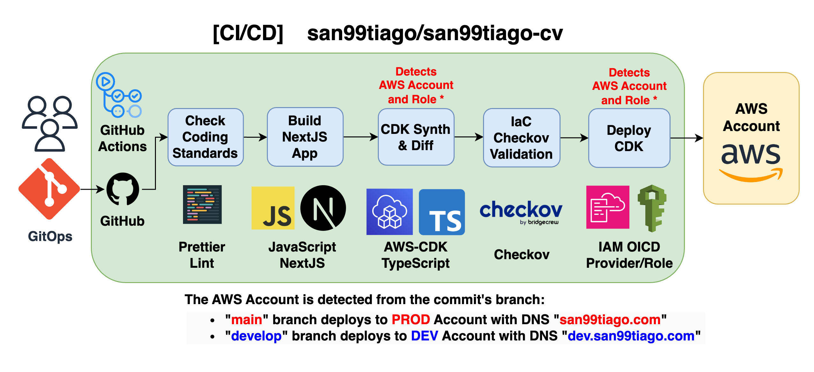

# ⚡ SAN99TIAGO-CV ⚡

Welcome to the _behind-the-scenes_ of [san99tiago.com](https://san99tiago.com), my personal CV website!

> I've proudly opened up the source-code, CI/CD, and infrastructure as code of my project to the world. Why? Because sharing is caring! Whether you're a seasoned developer looking for inspiration or a beginner eager to learn, this project could be helpful for you.

## 🚀 Project Overview

This is a modern, production-ready personal CV website showcasing professional experience, projects, and technical content. Built with performance, security, and scalability in mind, it demonstrates best practices in cloud-native development and DevOps.

### ✨ Key Features

- **Responsive Design**: Mobile-first approach with Chakra UI components
- **Performance Optimized**: Static site generation with Next.js for lightning-fast loading
- **Multi-Environment**: Separate DEV and PROD environments with automated deployments
- **Security First**: HTTPS enforcement, security headers, and AWS best practices
- **Scalable Architecture**: CloudFront CDN for global content delivery
- **Monitoring & Observability**: CloudWatch integration for performance tracking
- **Load Testing**: Automated performance validation with Locust

## 🏗️ Architecture & Technology Stack

 <br>

### Frontend Stack

- **[Next.js 13](https://nextjs.org)**: React-based framework with static site generation
- **[Chakra UI](https://chakra-ui.com)**: Modern component library for consistent design
- **[Framer Motion](https://www.framer.com/motion/)**: Smooth animations and transitions
- **[React Icons](https://react-icons.github.io/react-icons/)**: Comprehensive icon library

### AWS Cloud Infrastructure

- **Amazon S3**: Static website hosting with versioning and encryption
- **CloudFront**: Global CDN with custom domain and SSL/TLS certificates
- **Route 53**: DNS management for domain and subdomain routing
- **AWS Certificate Manager**: Automated SSL/TLS certificate provisioning and renewal
- **CloudWatch**: Monitoring, logging, and alerting for performance insights
- **CloudFront Functions**: URL rewriting for Next.js compatibility

### Infrastructure as Code

- **[AWS CDK](https://aws.amazon.com/cdk/)**: TypeScript-based infrastructure definitions
- **CloudFormation**: Underlying AWS resource provisioning
- **Multi-Account Strategy**: Separate AWS accounts for DEV and PROD environments

### DevOps & CI/CD

- **[GitHub Actions](https://docs.github.com/en/actions)**: Automated CI/CD pipelines
- **[Checkov](https://www.checkov.io/)**: Infrastructure security scanning
- **Multi-Environment Deployments**: Branch-based deployment strategy
- **Automated Testing**: Code quality checks, linting, and formatting

### Testing & Quality Assurance

- **[Locust](https://locust.io)**: Load testing framework for performance validation
- **ESLint**: JavaScript/TypeScript code linting
- **Prettier**: Code formatting and style consistency

## 📁 Project Structure

```
san99tiago-cv/
├── 📂 .github/workflows/     # CI/CD pipeline definitions
│   └── deploy.yml           # Main deployment workflow
├── 📂 .kiro/                # Kiro AI assistant configuration
│   └── steering/            # Project-specific AI guidance
├── 📂 assets/               # Documentation images and diagrams
├── 📂 cdk/                  # AWS CDK Infrastructure as Code
│   ├── bin/                 # CDK application entry point
│   ├── lib/                 # CDK stack definitions
│   │   └── cdk-stack.ts     # Main infrastructure stack
│   ├── package.json         # CDK dependencies
│   └── cdk.json            # CDK configuration
├── 📂 cloudfront_functions/ # CloudFront Functions
│   └── src/
│       └── url-rewrite.js   # URL rewriting for Next.js compatibility
├── 📂 src/                  # Next.js application source code
│   ├── components/          # Reusable React components
│   │   ├── layouts/         # Page layout components
│   │   ├── bio.js          # Biography components
│   │   ├── navbar.js       # Navigation component
│   │   └── ...             # Other UI components
│   ├── lib/                # Utility libraries
│   │   └── theme.js        # Chakra UI theme configuration
│   ├── pages/              # Next.js pages and routing
│   │   ├── experience/     # Experience detail pages
│   │   ├── index.js        # Homepage
│   │   ├── contact.js      # Contact page
│   │   └── ...            # Other pages
│   ├── public/             # Static assets
│   │   ├── images/         # Image assets organized by section
│   │   └── pdfs/          # PDF documents (CV, etc.)
│   ├── package.json        # Frontend dependencies
│   └── next.config.js      # Next.js configuration
├── 📂 tests/               # Testing suite
│   └── integration/        # Load testing with Locust
│       ├── locustfile.py   # Load test scenarios
│       └── requirements.txt # Python dependencies
├── build.sh                # Build script for Next.js static export
├── deploy.sh               # Deployment script for CDK
└── README.md              # Project documentation
```

## 🚀 Getting Started

### Prerequisites

- **Node.js 20+**: For running Next.js and CDK
- **AWS CLI**: Configured with appropriate credentials
- **AWS CDK**: For infrastructure deployment
- **Python 3.8+**: For load testing (optional)

### Local Development

1. **Clone the repository**

   ```bash
   git clone https://github.com/san99tiago/san99tiago-cv.git
   cd san99tiago-cv
   ```

2. **Install frontend dependencies**

   ```bash
   cd src
   npm install
   ```

3. **Run development server**

   ```bash
   npm run dev
   ```

   Visit `http://localhost:3000` to see the application.

4. **Install CDK dependencies** (for infrastructure work)
   ```bash
   cd ../cdk
   npm install
   ```

### Build and Export

Generate static files for deployment:

```bash
bash build.sh
```

This creates an optimized static export in `src/out/` directory.

## 🔧 Development Workflow

### Code Quality Standards

- **ESLint**: JavaScript/TypeScript linting with Next.js configuration
- **Prettier**: Consistent code formatting across the project
- **Pre-commit Checks**: Automated formatting and linting validation

### Available Scripts

**Frontend (src/ directory):**

```bash
npm run dev          # Start development server
npm run build        # Build for production
npm run build-export # Build and export static files
npm run lint         # Run ESLint
npm run prettier-check # Check code formatting
npm run prettier-write # Fix code formatting
```

**Infrastructure (cdk/ directory):**

```bash
npm run build        # Compile TypeScript
npm run watch        # Watch mode for development
cdk synth           # Synthesize CloudFormation templates
cdk diff            # Show infrastructure changes
cdk deploy          # Deploy to AWS
```

## 🚀 Deployment & CI/CD

### Automated Deployment Pipeline

The CI/CD automation is built on GitHub Actions with a sophisticated multi-environment strategy:

 <br>

### Branch Strategy

- **`main`**: Production deployments to [san99tiago.com](https://san99tiago.com)
- **`develop`**: Development deployments to [dev.san99tiago.com](https://dev.san99tiago.com)
- **Feature branches**: No automatic deployments (manual testing only)

### Pipeline Stages

The GitHub Actions workflow includes the following stages:

1. **Code Quality Checks**

   - ESLint validation
   - Prettier formatting verification
   - Node.js 20 environment setup

2. **Build Process**

   - Next.js static site generation
   - Artifact creation and storage
   - Build optimization and compression

3. **Infrastructure Validation**

   - CDK synthesis and diff generation
   - Checkov security scanning
   - CloudFormation template validation

4. **Security & Compliance**

   - Infrastructure security checks with Checkov
   - AWS resource compliance validation
   - Security headers and SSL/TLS verification

5. **Deployment**
   - Environment-specific AWS credential configuration
   - CDK deployment with approval controls
   - CloudFront cache invalidation

### Deployment Scripts

| Script                                                         | Purpose                        | Usage                          |
| -------------------------------------------------------------- | ------------------------------ | ------------------------------ |
| [`build.sh`](build.sh)                                         | Generate Next.js static export | `bash build.sh`                |
| [`deploy.sh`](deploy.sh)                                       | Deploy CDK infrastructure      | `bash deploy.sh <environment>` |
| [`.github/workflows/deploy.yml`](.github/workflows/deploy.yml) | CI/CD pipeline definition      | Triggered by git push          |

### Environment Configuration

**Production Environment:**

- Domain: `san99tiago.com`
- AWS Account: Production account with enhanced security
- S3 Versioning: Enabled for rollback capabilities
- Monitoring: Full CloudWatch integration

**Development Environment:**

- Domain: `dev.san99tiago.com`
- AWS Account: Separate development account
- S3 Versioning: Disabled for cost optimization
- Monitoring: Basic CloudWatch integration

## 🌐 DNS & Multi-Account Architecture

### DNS Workflow Diagram [Dev/Prod]

The DNS workflow is designed for a multi-account deployment with DEV/PROD environments:

 <br>

### Domain Strategy

- **PROD**: [san99tiago.com](https://san99tiago.com) → Always active
- **DEV**: [dev.san99tiago.com](https://dev.san99tiago.com) → Active for testing/validation

### Multi-Account Benefits

- **Security Isolation**: Complete separation between environments
- **Cost Management**: Independent billing and resource tracking
- **Access Control**: Environment-specific IAM policies and roles
- **Risk Mitigation**: Production isolation from development changes

## 🧪 Testing Strategy

### Load Testing with Locust

Performance validation using modern load testing:

```bash
cd tests/integration
pip install -r requirements.txt
python -m locust
```

**Test Scenarios:**

- Homepage loading performance
- Experience page navigation
- PDF document downloads
- Concurrent user simulation

**Metrics Tracked:**

- Response times
- Throughput (requests/second)
- Error rates
- Resource utilization

### Integration Testing

- **CloudFront Distribution**: CDN performance and caching
- **SSL/TLS Certificates**: Security and encryption validation
- **DNS Resolution**: Multi-environment domain routing
- **Static Asset Delivery**: Image and document serving

## 🔒 Security & Best Practices

### Security Implementation

- **HTTPS Enforcement**: All traffic redirected to HTTPS
- **Security Headers**: Comprehensive security header policy
  - Strict Transport Security (HSTS)
  - Content Security Policy (CSP)
  - X-Frame-Options protection
  - XSS protection headers
- **SSL/TLS Certificates**: Automated certificate management with AWS ACM
- **S3 Security**: Private buckets with CloudFront-only access
- **IAM Roles**: Least privilege access with environment-specific roles

### Performance Optimizations

- **Static Site Generation**: Pre-rendered pages for optimal loading
- **CDN Distribution**: Global content delivery via CloudFront
- **Image Optimization**: Next.js image optimization and compression
- **Caching Strategy**: Intelligent caching for static and dynamic content
- **Bundle Optimization**: Code splitting and tree shaking

### Monitoring & Observability

- **CloudWatch Integration**: Real-time metrics and logging
- **Certificate Monitoring**: Automated alerts for certificate expiration
- **Performance Tracking**: Response times and error rate monitoring
- **Cost Optimization**: Resource usage and billing alerts

## 🛠️ Infrastructure Details

### AWS CDK Stack Components

The infrastructure is defined using AWS CDK with TypeScript:

**Core Resources:**

- **S3 Bucket**: Static website hosting with encryption and versioning
- **CloudFront Distribution**: Global CDN with custom domain support
- **Route 53 Records**: DNS management for primary and www domains
- **ACM Certificate**: SSL/TLS certificate with automatic renewal
- **CloudFront Functions**: URL rewriting for Next.js compatibility

**Security Features:**

- **Origin Access Identity**: Secure S3 access via CloudFront only
- **Response Headers Policy**: Security headers enforcement
- **SSL/TLS Configuration**: Modern encryption standards
- **Access Logging**: Comprehensive request logging

### CloudFront Functions

Custom JavaScript function for URL rewriting:

- Handles Next.js static export routing
- Ensures proper `.html` file serving
- Maintains clean URLs for better UX

## 📊 Performance Metrics

### Load Testing Results

Based on Locust load testing framework:

- **Concurrent Users**: Tested up to 100+ simultaneous users
- **Response Times**: Average < 200ms for static content
- **Throughput**: 1000+ requests/second capability
- **Error Rate**: < 0.1% under normal load conditions

### CloudFront Performance

- **Global Edge Locations**: 400+ edge locations worldwide
- **Cache Hit Ratio**: 95%+ for static assets
- **Origin Shield**: Additional caching layer for improved performance

## 🚨 Important Operational Notes

### Certificate Management

The Route 53 Hosted Zones are pre-configured in both DEV and PROD AWS accounts, enabling automatic ACM certificate validation during CDK deployment. If hosted zones were managed in different AWS accounts, manual DNS validation would be required to verify domain ownership.

### Infrastructure Destruction

**⚠️ Caution: Destruction is manual-only to prevent accidental deletions**

Two options for infrastructure cleanup:

1. **CloudFormation Console**: Delete the stack directly from AWS Console
2. **CDK CLI**: Set environment variable and destroy
   ```bash
   export DEPLOYMENT_ENVIRONMENT=dev  # or prod
   cd cdk
   cdk destroy
   ```

> **Note**: Destruction is intentionally excluded from CI/CD pipelines to prevent accidental production outages.

### Cost Optimization

- **S3 Intelligent Tiering**: Automatic cost optimization for storage
- **CloudFront Pricing**: Optimized for global distribution
- **Development Environment**: Reduced features for cost efficiency
- **Resource Tagging**: Comprehensive tagging for cost allocation

## 🤝 Contributing

### Development Guidelines

1. **Fork the repository** and create a feature branch
2. **Follow code standards**: ESLint and Prettier configurations
3. **Test your changes**: Run local development server
4. **Update documentation**: Keep README and comments current
5. **Submit pull request**: Include detailed description of changes

### Code Style

- **JavaScript/TypeScript**: ES6+ features, modern React patterns
- **Component Structure**: Modular, reusable components
- **Styling**: Chakra UI components with consistent theming
- **Accessibility**: WCAG 2.1 compliance for inclusive design

## 📚 Learning Resources

This project demonstrates several advanced concepts:

- **Static Site Generation**: Next.js export functionality
- **Infrastructure as Code**: AWS CDK with TypeScript
- **CI/CD Pipelines**: GitHub Actions workflows
- **Multi-Account AWS**: Environment separation strategies
- **Performance Testing**: Load testing with Locust
- **Security Best Practices**: AWS security implementation
- **DNS Management**: Multi-domain routing strategies

## 🔗 Related Projects

- **[AWS CDK Examples](https://github.com/aws-samples/aws-cdk-examples)**: Official CDK examples
- **[Next.js Documentation](https://nextjs.org/docs)**: Next.js framework guide
- **[Chakra UI Components](https://chakra-ui.com/docs/components)**: UI component library
- **[AWS Well-Architected](https://aws.amazon.com/architecture/well-architected/)**: AWS architecture best practices

## 📈 Future Enhancements

- **Content Management**: Headless CMS integration
- **Analytics**: Advanced user behavior tracking
- **Internationalization**: Multi-language support
- **Progressive Web App**: PWA capabilities
- **API Integration**: Dynamic content features
- **Advanced Monitoring**: Custom CloudWatch dashboards

## 👨‍💻 Author

### Santiago Garcia Arango

<table border="1">
    <tr>
        <td>
            <p align="center">Curious DevOps Engineer passionate about advanced cloud-based solutions and deployments in AWS. I am convinced that today's greatest challenges must be solved by people that love what they do.</p>
            <br>
            <p align="center">
                <strong>AWS Community Builder | AWS User Group Medellin Leader</strong><br>
                <strong>Cloud Architect | DevOps Specialist</strong>
            </p>
        </td>
        <td>
            <p align="center"></p>
        </td>
    </tr>
</table>

### Connect with Santiago

- 🌐 **Website**: [san99tiago.com](https://san99tiago.com)
- 💼 **LinkedIn**: [san99tiago](https://www.linkedin.com/in/san99tiago/)
- 🐙 **GitHub**: [san99tiago](https://github.com/san99tiago)
- 📺 **YouTube**: [Santiago Garcia Arango Tech](https://www.youtube.com/@san99tiago)
- 📧 **Email**: Available on website contact page

## 📄 License

Copyright 2023 Santiago Garcia Arango

This project is open source and available under the [Apache License 2.0](LICENSE).

---

<p align="center">
  <strong>⚡ Built with passion for cloud technologies and modern web development ⚡</strong>
  <br>
  <em>Sharing knowledge, one commit at a time</em>
</p>
