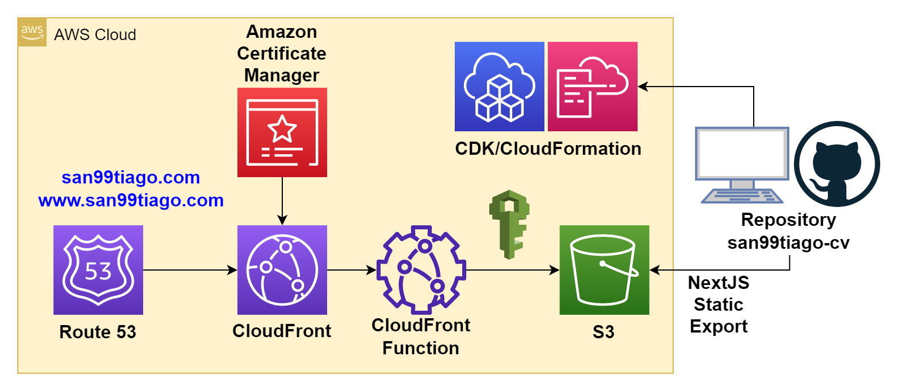
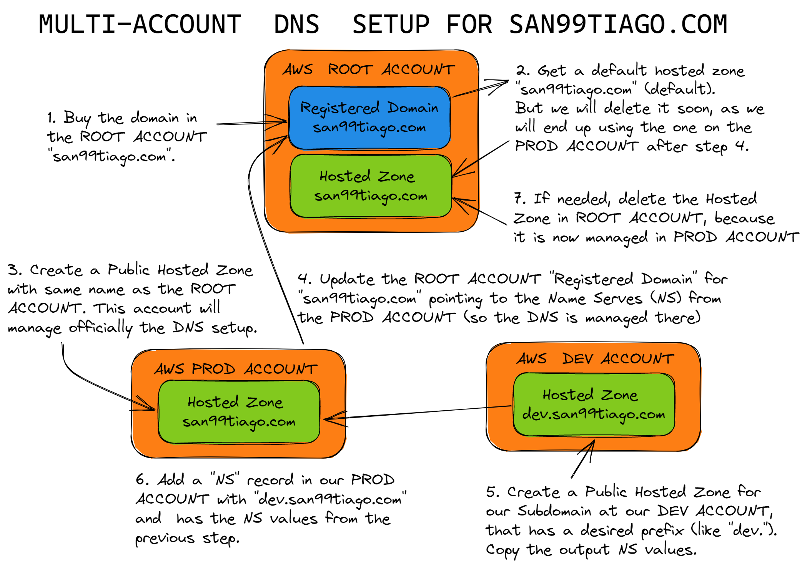

# :scroll: SAN99TIAGO-CV :scroll:

Source code and Infrastructure for my personal [san99tiago.com](https://san99tiago.com) CV-like website.

The solution was developed as a Single Page Application website on top of [NextJS](https://nextjs.org) (production-grade framework on top of React), and deployed on AWS with an S3 bucket and a CDN on top of CloudFront.

## Diagrams

The solution's diagrams can be divided into 2 categories:

- AWS Architecture Diagram (main AWS resources and solution)
- DNS Workflow Diagram [Dev/Prod] (how DNS/R53 is configured)

### AWS Architecture Diagram

The AWS infrastructure solution is deployed with CDK-TypeScript with the resources defined on the `cdk` folder:

  

### DNS Workflow Diagram [Dev/Prod]

The DNS workflow is designed for a multi-account deployment with DEV/PROD environments. The idea is to have the following final endpoints and test any change on `DEV` environment prior to the `PROD` deployment:

- DEV: [dev.san99tiago.com](https://dev.san99tiago.com)
- PROD: [san99tiago.com](https://san99tiago.com)

To achieve these multiple DNS environments, 2 independent AWS accounts are used for the deployments (DEV/PROD), and the `dev.san99tiago.com` is delegated as a Route 53 Sub-Domain Hosted Zone in the `DEV` account.

  

## Deployment

Currently, there is no automatic CI/CD deployment based on the repository branch (future state).

However, the deployments are done with the following files:

- [`build.sh`](build.sh): Bash file to generate the NextJS static artifact (export) for the Single Page Application:
  - Run with: `bash build.sh` .
  - Outputs: `./out/` folder with the static files inside.
- [`deploy.sh`](deploy.sh)
  - Run with: `bash deploy.sh <environment>` (set environment to `prod` or `dev`).
  - Behavior: deploys the solution based on current AWS Profile/Credentials and the given environment.

## Destroy

If destroys are needed, we have 2 options:

- Directly delete the CloudFormation Stack (either via console or CLI).
- Setting an environment variable of the target environment, for example: `export DEPLOYMENT_ENVIRONMENT=dev` and run `cdk destroy`.

## Important Remarks

As I have already configured the Route 53 Hosted Zones on the target deployment accounts (dev/prod domains), the ACM Certificate validation process (the one attached to the CloudFront distribution) is automatic during the CDK/CloudFormation deployment. If the Hosted Zones were managed in other AWS accounts, the validation of the certificates would need to be done during the deployment manually in the Hosted Zone corresponding to the domain as a DNS validation to double check that we own the domain.

## LICENSE

Copyright 2023 Santiago Garcia Arango
