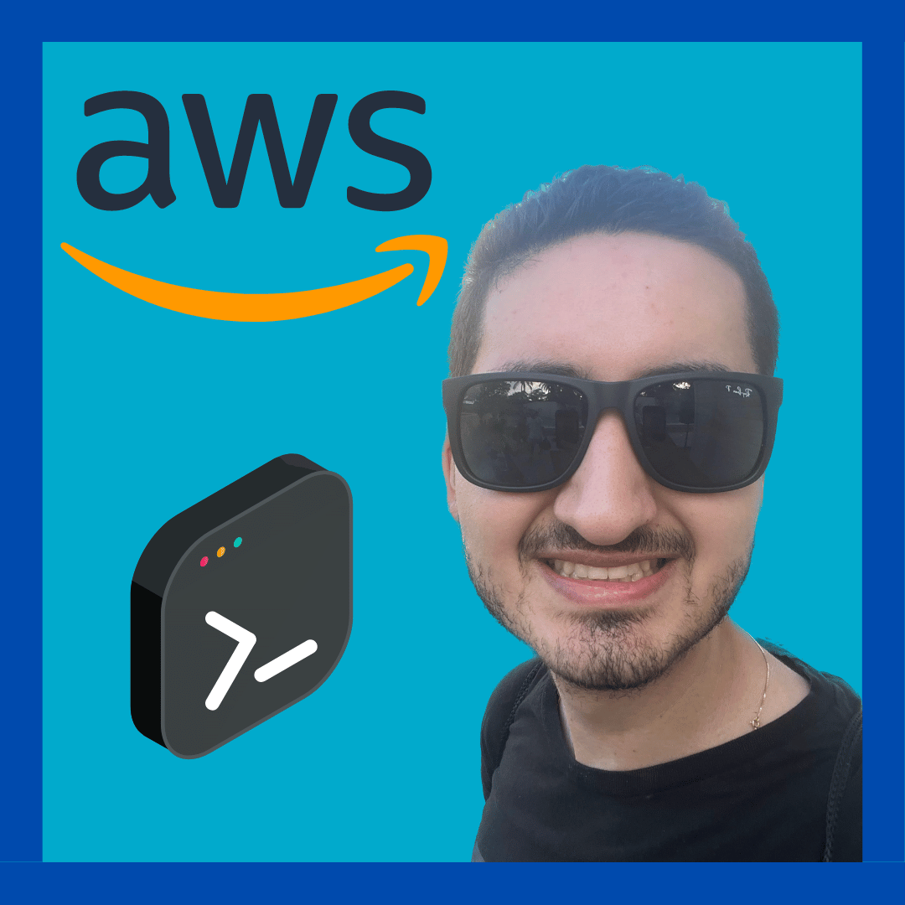

# ⚡ SAN99TIAGO-CV ⚡

Welcome to the _behind-the-scenes_ of [san99tiago.com](https://san99tiago.com) , my personal CV website!

> I've proudly opened up the source-code, CI/CD, and infrastructure as code of my project to the world. Why? Because sharing is caring! Whether you're a seasoned developer looking for inspiration or a beginner eager to learn, this project could be helpful for you.

## AWS Architecture

  

This awesome project was developed as a Single Page Application website on top of:

- Source Code on [NextJS](https://nextjs.org): Production-grade Frontend framework on top of React.
- Infrastructure and Resources on [Amazon Web Services](https://aws.amazon.com): biggest cloud-computing provider.
  - Amazon S3 for hosting/deploying the static website files (Object Storage).
  - CloudFront to distribute the site as a Content Delivery Network (CDN).
  - Route 53 for the DNS management for top level domain and subdomains.
  - AWS Certificate Manager for the SSL/TLS certificate and security lifecycle.
  - CloudWatch for observability on top of the requests and application management.
- Infrastructure as Code on [AWS Cloud Development Kit](https://aws.amazon.com/cdk/): IaC abstraction of top of common programming languages (in this case built with TypeScript).
- Software Development Life Cycle: Leverages [GitHub Actions](https://docs.github.com/en/actions) with CI/CD automation that is able to update the AWS solution E2E on both DEV/PROD accounts.
- Unit Tests: vary depending on the project's scope.
- Integration/Load Tests: built on top of [Locust Framework](https://locust.io): Modern load testing tool.

## Deployment

The CI/CD automation is built on top of GitHub Actions and GitHub Workflows. It is driven by the branch as follows:

- `main`: reserved for PROD deployments.
- `develop`: reserved for DEV deployments.
- Other Branches: can be created but will NOT trigger the CI/CD.

  

To dive deeper into the deployment scripts, please explore the following files:

- [`.github/workflows/deploy.yml`](.github/workflows/deploy.yml): Definition of the GitHub Workflow for the pipeline that will trigger the deployments.
- [`build.sh`](build.sh): Bash file to generate the NextJS static artifact (export) for the Single Page Application:
  - Outputs: `./out/` folder with the static files inside.
- [`deploy.sh`](deploy.sh)
  - Run with: `bash deploy.sh <environment>` (set environment to `prod` or `dev` or leverage CI/CD).
  - Behavior: deploys the solution based on current AWS Profile/Credentials and the given environment.

## DNS Workflow Diagram [Dev/Prod]

The DNS workflow is designed for a multi-account deployment with DEV/PROD environments. The idea is to have the following final endpoints and test any change on `DEV` environment prior to the `PROD` deployment:

- PROD: [san99tiago.com](https://san99tiago.com) --> Always active
- DEV: [dev.san99tiago.com](https://dev.san99tiago.com) --> Only active for tests/validations

To achieve these multiple DNS environments, 2 independent AWS accounts are used for the deployments (DEV/PROD), and the [dev.san99tiago.com](https://dev.san99tiago.com) is delegated as a Route 53 Sub-Domain Hosted Zone in the `DEV` account.

  

## Important Remarks

### Route 53 Hosted Zones and CloudFront Distribution

As I have already configured the Route 53 Hosted Zones on the target deployment accounts (dev/prod domains), the ACM Certificate validation process (the one attached to the CloudFront distribution) is automatic during the CDK/CloudFormation deployment. If the Hosted Zones were managed in other AWS accounts, the validation of the certificates would need to be done during the deployment manually in the Hosted Zone corresponding to the domain as a DNS validation to double check that we own the domain.

### Destroy Process (Only Manually)

If destroys are needed, we have 2 options:

- Directly delete the CloudFormation Stack (either via console or CLI).
- Setting an environment variable of the target environment, for example: `export DEPLOYMENT_ENVIRONMENT=dev` and run `cdk destroy`.

> Note: They are not supported in CI/CD to avoid potential destroy errors.

## Author

### Santiago Garcia Arango

<table border="1">
    <tr>
        <td>
            
Curious DevOps Engineer passionate about advanced cloud-based solutions and deployments in AWS. I am convinced that today's greatest challenges must be solved by people that love what they do.

        </td>
        <td>
            

        </td>
    </tr>
</table>

## LICENSE

Copyright 2023 Santiago Garcia Arango
